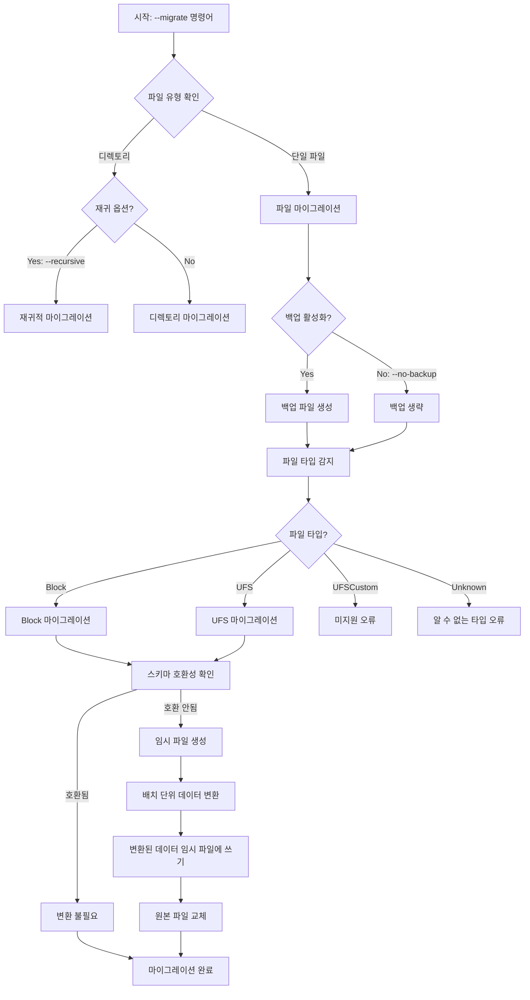
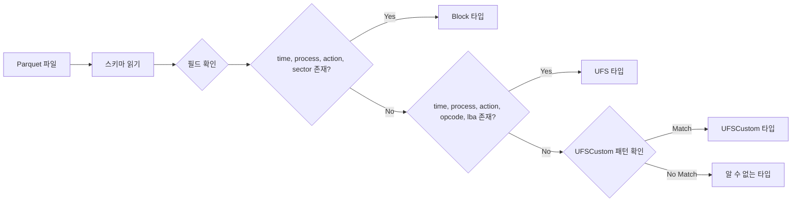
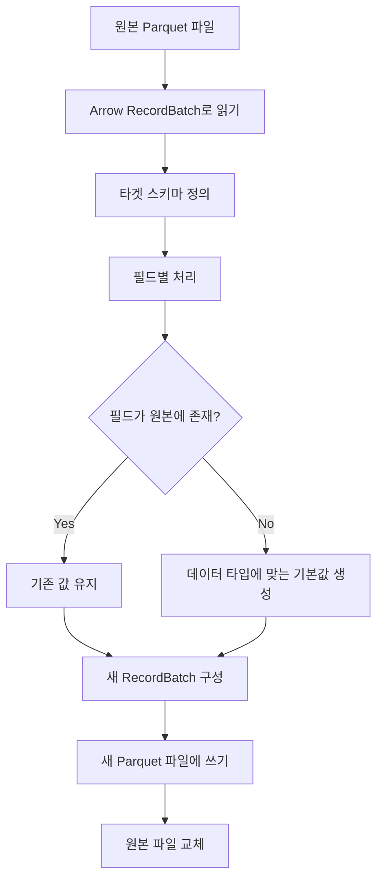
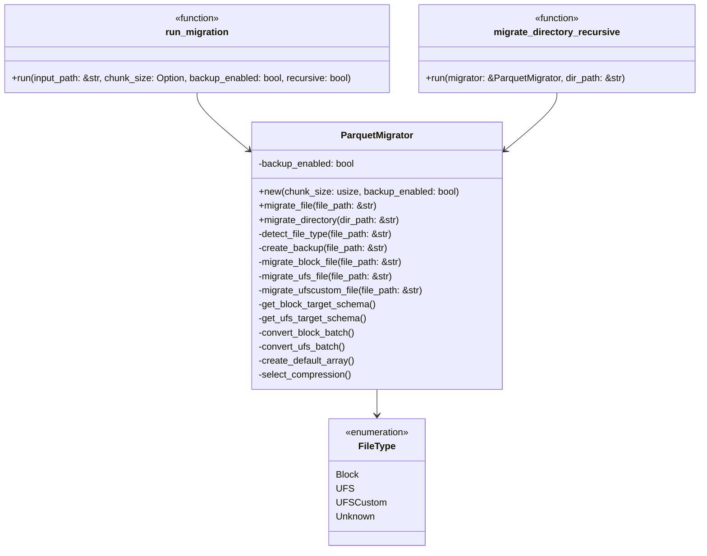

# Parquet 마이그레이션 다이어그램

이 문서는 Parquet 마이그레이션 도구의 핵심 프로세스와 데이터 흐름을 시각적으로 표현합니다.

## 마이그레이션 처리 흐름



## 파일 타입 감지 프로세스



## 스키마 변환 프로세스



## 컴포넌트 다이어그램



## 데이터 변환 예시 (Block 파일)

아래는 Block 파일 스키마 변환의 예시를 보여줍니다:

### 원본 스키마

```
time: Float64
process: Utf8
action: Utf8
sector: UInt64
size: UInt32
```

### 타겟 스키마

```
time: Float64      <- 기존 필드
process: Utf8      <- 기존 필드
cpu: UInt32        <- 새 필드 (기본값 0)
flags: Utf8        <- 새 필드 (기본값 "")
action: Utf8       <- 기존 필드
devmajor: UInt32   <- 새 필드 (기본값 0)
devminor: UInt32   <- 새 필드 (기본값 0)
io_type: Utf8      <- 새 필드 (기본값 "")
extra: UInt32      <- 새 필드 (기본값 0)
sector: UInt64     <- 기존 필드
size: UInt32       <- 기존 필드
comm: Utf8         <- 새 필드 (기본값 "")
qd: UInt32         <- 새 필드 (기본값 0)
dtoc: Float64      <- 새 필드 (기본값 0.0)
ctoc: Float64      <- 새 필드 (기본값 0.0)
ctod: Float64      <- 새 필드 (기본값 0.0)
continuous: Boolean <- 새 필드 (기본값 false)
```

## 파일 크기별 압축 전략

파일 크기에 따른 동적 압축 전략:

| 파일 크기 | 압축 알고리즘 | 목적 |
|-----------|--------------|------|
| < 1MB | SNAPPY | 빠른 속도 우선 |
| 1MB ~ 10MB | ZSTD (레벨 3) | 속도와 압축률 균형 |
| 10MB ~ 100MB | ZSTD (레벨 6) | 높은 압축률 |
| ≥ 100MB | ZSTD (레벨 9) | 최고 압축률 |
